# Assignment 5: Ray Tracing, more and better!

In this week's extension to the ray tracing assignment we add support for texture mapping and smooth shading of triangle meshes.  This requires some pretty small and local changes to the code, but enables a lot more to be rendered.  Using triangles organized in meshes will also help us get the performance up for triangulated models.

## Requirements 

Your renderer should still render the same scenes as before, but now it will support additional scenes that contain textures and meshes.  The key new requirements are:

* Indexed triangle meshes are supported, using the `Mesh` class.  In ray intersection they behave as if they were a collecion of `Triangle`s, except that if there are normals or uvs specified in the mesh, they are interpolated and override the geometric normals and barycentric uvs.

* Geometry now supplies uv coordinates.  For the sphere, uvs are always (longitude, latitude) coordinates with the poles on the y axis and the seam facing the -z direction.  For triangles or for meshes without uv coordinates specified, uv coordinates are the (beta, gamma) of the barycentric coordinates.  For meshes with uv coordinates specified, the uvs are defined by linear interpolation.

* Materials can now support texture maps.  For each of the material parameters `k_d`, `k_s`, `k_m`, and `k_a`, the untextured property can be either a scalar (meaning it is the same in R, G, and B) or a 3-vector (meaning an RGB color), and for `p` it is a scalar.  Any scalar property can be replaced by an array of shape (h, w), and any RGB texture can be replaced by array of shape (h, w, 3).  When an array like this (recognizable as an array with at least 2 dimensions) is used, then it is a texture map to be applied using the uv coordinates supplied by the geometry.  Nearest neighbor interpolation is OK for this texture lookup.  Out of bounds accesses should be wrapped so that the texture repeats.

To help you implement meshes, we are supplying one more useful function in the `utils` package, called `batch_intersect`.  This method efficiently intersects a ray with an array of triangles and returns the closest hit with its barycentric coordinates.  If you use this rather than calling your ray-triangle intersection function for every triangle in a mesh, you can get the same result much faster.  This function will be released after the due date for the first part of the ray tracing assignment, to avoid spoiling the ray-triangle intersection task from that assignment.

## Implementation notes

As before, here's a recommended implementation sequence with reference images along the way.

First implement uv coordinates for spheres and triangles.  Temporarily modify your shading routine to simply return (u, v, 0) as the color.  You should get a picture like this.

| two_spheres | cube    |
| -----------  | ----------- |
| 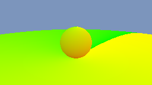| 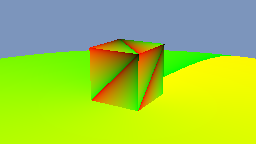 |

Next implement texture mapping.  This means when you read each shading parameter you first check whether it's a texture map or not.  With this you can render a globe with its earth-map texture (`sphere_globe.py`) applied on the diffuse component `k_d`, and render `cube_tex.py` to see that you are getting the barycentric coordinates on each face. The `three_spheres_textured.py` textures all other parameters, including `k_s`, `p`, `k_m` and `k_a`. We also provide a higher resolution version `ref/three_spheres_textured_1024.png`, which you can compare with using `python3 three_spheres_textured.py --nx 1024`.

When computing texture coordinates for the sphere, note that the texture coordinate can be computed as the spherical coordinates of the surface normal vector, scaled to the range [0,1] x [0,1].

For this phase you will want to find a clean and simple way to handle constant and textured material parameters.  We found it cleanest to have the `Material` class responsible for texture lookups.  When you fetch a material parameter to be used in shading, you will need the uv coordinate of the shading point (from the `Hit` object).  Programmatically, the rules laid out above boil down to the following cases:

* If the material parameter is a scalar (a Python number or a 0D array), ignore the uv coordinate and just use the parameter; it will scale all channels the same.
* If the material parameter is a 1D array, ignore the uv coordinate and just use the parameter; it will scale the three channels separately.
* If the material parameter is a 2D array, perform a texture lookup and return a scalar.
* It the material parameter is a 3D array, perform a texture lookup over the first two dimensions and return a 1D array (an RGB vector).

If you are careful you can handle these cases with just two cases in the code (textured or constant), since indexing a 3D array with two indices will return a 1D array.

| sphere_globe | cube_tex    | three_spheres_textured |
| -----------  | ----------- | ----------- |
| 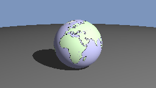| 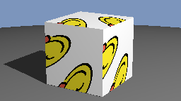 | 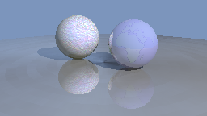 |

Next implement meshes, just using the same computations for normal and uv coordinates as the triangle.  You should then be able to render `mesh_cube.py`, resulting in the same image as `cube.py`; or `mesh_cube_tex.py` with the same result as `cube_tex.py` (upon replacing the dice texture with `textures/faces.png`).
You can render `tree.py` and `two_globes.py`, but the texture coordinates will be wrong.

| mesh_cube | mesh_cube_tex    | tree | two_globes |
| -----------  | ----------- | -----------  | ----------- |
| 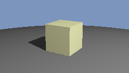| 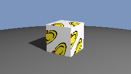 | 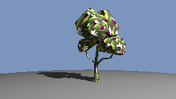 | 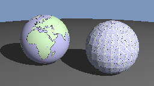 |

Finally implement interpolation of normals and texture coordinates.  This just requires extending the mesh intersection method so that if there are normals present, it interpolates a normal instead of returning the geometric normal, and if there are uvs present, it interpolates a uv instead of returning the barycentric uv.  Then you can render the smooth triangulated globe, the cube with the dice texture, and the tree (which gets what look like per-face colors by using a very simple texture with solid color blocks).

| two_globes | mesh_cube_tex    | tree |
| -----------  | ----------- | -----------  |
| 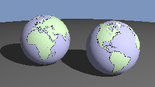| 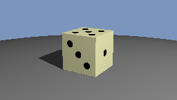 | 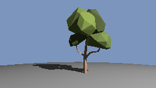 |

---

## Sources

* Emoji are from openmoji.org
* Dice texture from Francois Faure
* Jupiter texture from solarsystemscope.com
* Trees are by Broken Vector from https://brokenvector.itch.io/low-poly-tree-pack

## Creative portion

Similar to Assignment 4, create another interesting image with your ray tracer, this time with features implemented from A5, e.g. textures on different types of primitives. You can extend your creative scene from Assignment 4, or create a new scene. Again, this is a pretty light creative portion, and will only have 10% weight in the score.

## Handing in

Hand in `ray.py` (it should be self-contained), and an image for the creative part.

The functions you need to implement are marked with `A5 TODO`. As a first step, you need to copy over certain parts of your ray tracing code, and make modifications as indicated in the function comments.
